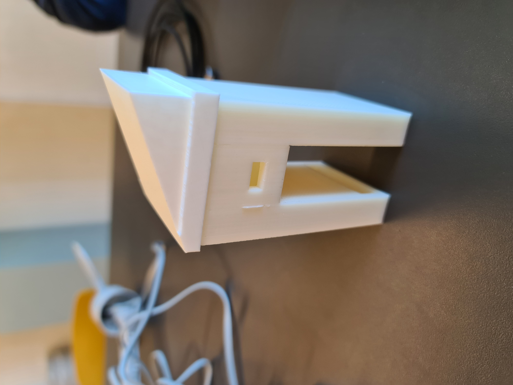

# Final delivery

This document will contain everything we will deliver to the client at the end of the project. That means there will be info here about the hardware and software of the device and any other important information.

## Software

The software is split into a couple of parts, the front-end and the back-end. The front-end is the part which the user can see, the webpages and the looks of it. The back-end are the parts the user cannot see. This includes a database, security and a lot of functionality.

### Front-end

The front-end consists of a few pages; the loading screen, the main page and the personal page. The loading screen is just a screentransition in which the website has time to load all the correct data. It looks like this:  

|  |
| :-------------------------------------------: |
|          Loading screen           |  

The main page is the page shown after the loading screen. This screen shows the most recent data collected by the database. This looks as follows: ADD SCREENSHOT MAIN PAGE FINAL VERSION  
The personal page is a page which can be navigated to through the main page. Every run is connected to a driver, clicking on these drivers will take them to their own page, showing the data connected to them through their runs. This looks as follows: ADD SCREENSHOT PERSONAL PAGE FINAL VERSION

### Back-end

## Physical device

The physical device also consists of multiple parts, which can be explained individually. The 3d print, which is the casing of the device and makes sure the electronics are protected. The wiring, which is how the wires are connected from the sensors to the wemos. Lastly, there is the code on the wemos, this code makes sure the wemos uses the data from the sensors correctly and sends it to the designated location.

### Casing

The casing is designed to be weatherproof, due to this, a couple of measurements have been taken in designing the casing. This is how the casing looks:  

|  |
| :-------------------------------------------: |
|          Full casing for the device           |  

The roof is slanted, so the water that can rain on top of it automatically falls off and has a low chance of actually getting into the device. The device has these 'legs' to let the wires go to the wemos savely without encountering water. Lastly, there is the hole in the middle of the device. This is to connect the wemos to a power supply with a usb wire, which sits in the middle of the device.

### Sensors

We are using multiple sensors on our device to read data on multiple things regarding the weather. We have a humidity sensor, a temperature sensor, a windspeed sensor and a winddirection sensor.  
For the humidity and the temperature, we are using a [combined sensor module](https://elektronicavoorjou.nl/product/dht22-temp-vocht-sensor/?utm_campaign=organic_shopping&utm_content=&utm_source=google&utm_medium=organic&utm_term=&gclid=Cj0KCQjwntCVBhDdARIsAMEwACkGb2X-jlnPqTqaltdO49JmOLQFREfF94tp1S9dRzX6pyGRSkC0wYUaAm8hEALw_wcB). It looks like this in real life:  

|  |
| :-------------------------------------------: |
|                    Temperature and humidity sensors |  

We are also using a combined sensor module for the windspeed and winddirection sensors, you can buy these [here](https://www.robotshop.com/nl/nl/sparkfun-weermeterset.html). These look as follows in real life:  

|  |
| :-------------------------------------------: |
|                    Windspeed and winddirection sensors |  

### Wiring

### Wemos configuration
