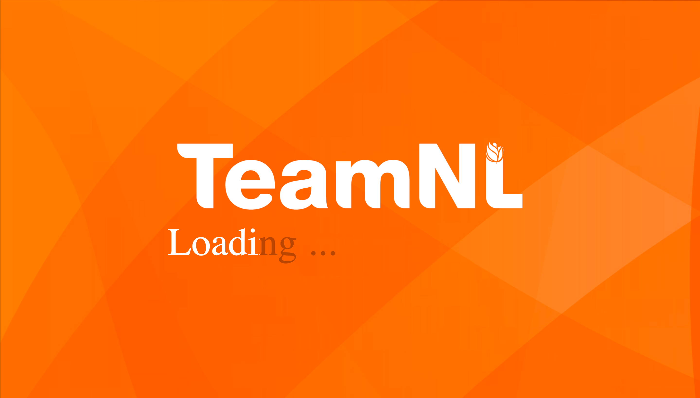

# Web Application

## Introduction

For this project there are 2 frameworks we are going to use for our web-application:

- Spring boot (back-end framework)
- Angular 6 (front-end framework)

We will also use a mysql database provided by OEGE to store data.

We will make sure the following functionalities will be implemented on the web-app:

- ability to export data into json-files
- ability for the coach and athlete to see the performance of the athlete
- ability to see improvement of the athlete and what might have affected his/her performance

## Front-end

The front-end currently looks as follows:  

||
| :-:|
|Loading page|  

||
| :-:|
|front page|  

it gathers data from the back-end, to fill the table with data. It gather this data through this code:  

```html
<tr *ngFor="let athlete of athletes; let i= index">
        <th>{{athlete.id}}</th>
        <th>{{athlete.firstName}} {{athlete.surname}}</th>
        <th>{{athlete.trackTimeRecords[0].windSpeed}}</th>
        <th>{{athlete.trackTimeRecords[0].recordedValue}}</th>
        <th>{{athlete.trackTimeRecords[0].recordedTime}}</th>
      </tr>
```

```js
restGetAthletes(): Observable<Athlete[]>{
    return this.httpClient.get<Athlete[]>("http://localhost:80/athlete")
      .pipe(
        map(responseData => {
        const athleteArray: Athlete[] = [];
        for(const key in responseData){
          responseData[key].trackTimeRecords;
          athleteArray.push(responseData[key])
        }
        console.log("initial list", athleteArray)
        return athleteArray
      })
      );
  }
```

## Back-end
