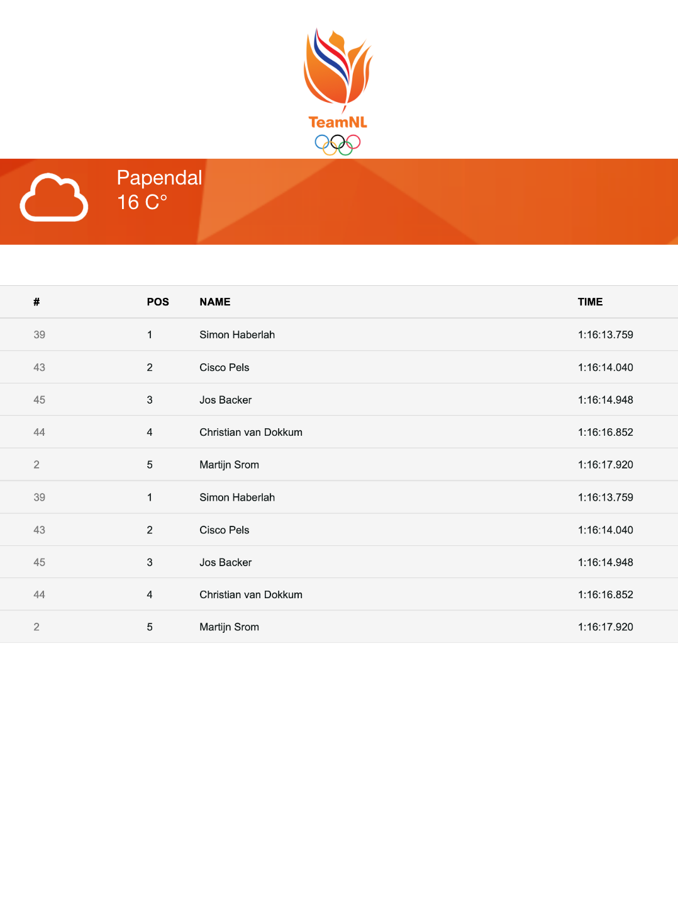
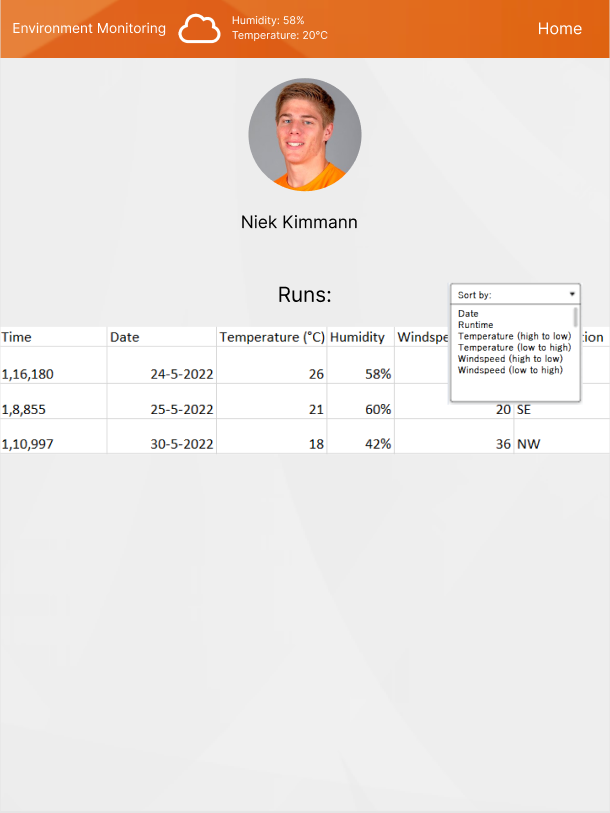
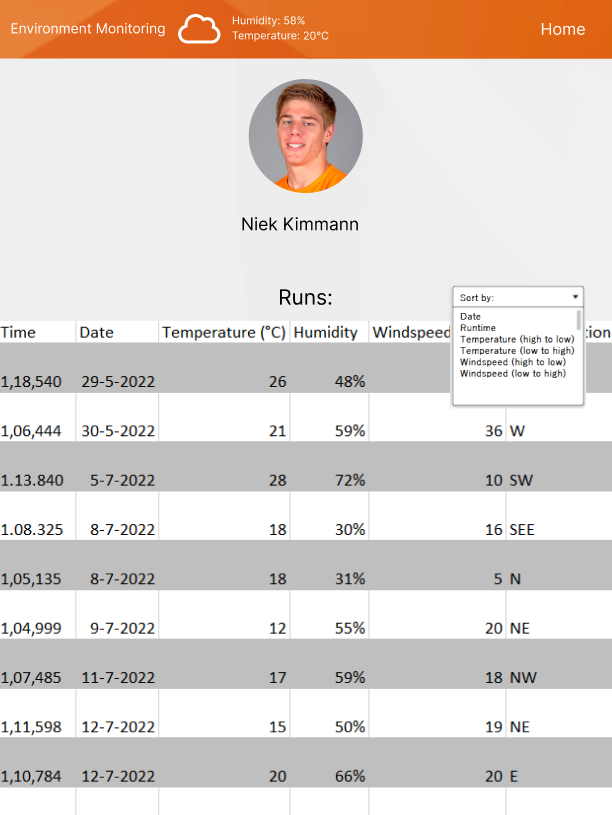

# Website Design

## Styling

Regarding styling, we are gonna use the styling used for the [public website from Team-NL](https://teamnl.org/).

## Design sketch

We made a few design sketches for some of the different pages of the web application.

### Home page

|  |
| :---------------------------------: |
|              Frontpage              |

### Information page

|  |
| :--------------------------------: |
|             Mainpage1              |

|  |
| :--------------------------------: |
|             Mainpage2              |

### Personal page

|  |
| :------------------------------------------: |
|                Personal page                 |  

We made a new version of the table as the sketch previously was not clear enough, this is the result.  

|  |
| :------------------------------------------: |
|                Personal page version 2                 |
