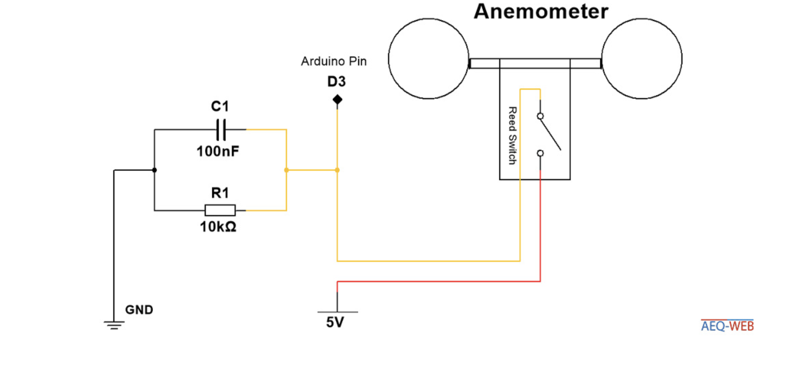
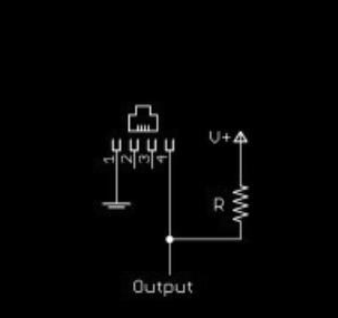

# Sensors

## Weather Station

### Wind speed (Anemometer) + direction sensor

#### Wind Speed Sensor (Anemometer)

### Humidity & Temperature Sensor

We're using a DHT22 sensor.
Here is the code we're running
```cpp
#include "DHTesp.h"
DHTesp dht;
 
void setup() {
    Serial.begin(115200);
    dht.setup(D2, DHTesp::DHT22);
}
 
void loop() {
    float h = dht.getHumidity();
    float t = dht.getTemperature();
 
    Serial.print("humidity: ");
    Serial.println(h);
    Serial.print("temp: ");
    Serial.println(t);
 
    delay(2000);
}

```
It is wired this way:

||
| :-:|
|DHT22 Humidity and Temperature sensor|


this is how the wiring looks in reality:


||
| :-:|
|DHT22 Humidity and Temperature sensor|


this is the data coming from the sensor:

||
| :-:|
|Data coming form the DHT22 sensor|

## Selection of sensors

### Professional option

Davis is a reputable brand that produces weather station sensors.
This is their wind speed and wind direction sensor combo. It is expensive but might be an option if we need more precise data.
It also has the benefit of working out of the box. Therefore leaving us more time to work on the rest of the features.
<center>


||
| :-:|
|[Davis 6410](https://www.davis-europe.nl/product/davis-6410-anemometer-for-vantage-pro2-vantage-pro/)|


</center>

### DIY option

This option is the cheapest one.  The drawbacks are accuracy, the time it will take to build / calibrate the device, and it will not look as good as the professional option. Waterproofing is also a concern.

<center>


||
| :-:|
|Rotary sensor sketch|


</center>


#### Wind direction sensor

We would use a rotary encoder, an electronic component used mainly in knobs and dials. The idea would be 
to 3D print a specific shape and put it on top of the encoder.
The wind would push the shape which would turn the "knob" until it reaches the position where   
the resistance is minimal, therefore determining the direction.
Another option that we might use is a hall effect sensor. It uses the same logic as the previous methods
but this one uses a gravity field to measure the rotation of the object. 


#### Wind speed sensor (Anemometer)

the idea here is to have wings on a frictionless axle.  
That way the wind will push the wings and make them rotate.  
Then we would use an IR emitter and receiver. The wings would pass in between the two.  
It would block the  signal.  
We would count the amount of interruptions of the signal and guess the speed that way.   
To calibrate the sensor we would use a car. We'd get the device out of the window and measure the amount of rotations the wings do at certain speeds, that we can precisely identify using the car's speedometer.

## Implementation

### Weather station

||
| :-:|
|[Weahter station we choosed with our customer](https://www.robotshop.com/nl/nl/sparkfun-weermeterset.html)|

| |
| :-------------------------------------------------------: |
|RJ11 pinout weahter station wind direction and speed meter|

[Arduino measure wind speed tutorial](https://www.aeq-web.com/arduino-anemometer-wind-sensor/?lang=en)

This is the schematic to connect the anemometer to a Arduino Uno

|  |
| :----------------------------------------------------------------------: |
|                   Schematic anemometer to arduino Uno                    |

We have made the windspeed sensor work!


|  |
| :--------------------------------------------------: |
|               Windspeed meter testing                |


|  |
| :-------------------------------------------------: |
|      Windspeed meter working with the terminal      |


|  |
| :---------------------------------------------------: |
|              Windspeed meter connection               |


The code we are using to control the windspeed meter

<details>
  <summary>Click to see Code!</summary>

```cpp
const int RecordTime = 3; //Define Measuring Time (Seconds)
const int SensorPin = 3;  //Define Interrupt Pin (2 or 3 @ Arduino Uno)

int InterruptCounter;
float WindSpeed;

void setup()
{
  Serial.begin(9600);
}

void loop() {
  meassure();
  Serial.print("Wind Speed: ");
  Serial.print(WindSpeed);       //Speed in km/h
  Serial.print(" km/h - ");
  Serial.print(WindSpeed / 3.6); //Speed in m/s
  Serial.println(" m/s");
}

void meassure() {
  InterruptCounter = 0;
  attachInterrupt(digitalPinToInterrupt(SensorPin), countup, RISING);
  delay(1000 * RecordTime);
  detachInterrupt(digitalPinToInterrupt(SensorPin));
  WindSpeed = (float)InterruptCounter / (float)RecordTime * 2.4;
}

void countup() {
  InterruptCounter++;
}
```


</details>


The code used for the wind direction sensor is the following:
```cpp

void loop() {
  // read the input on analog pin 0:
  int sensorValue = analogRead(A0);
  float voltage = sensorValue*5/1023.0;
  int direction = map(sensorValue, 0, 1023, 0, 360);
  Serial.print("Direction : ");
  Serial.println(direction);
  delay(300); 
}

```

This is how the sensor is wired, we're using a 10k resistor and 5V:


|  |
| :---------------------------------------: |
|         Wind vane wiring diagram          |

Then we tried to get all the sensors connected at the same time. We went outside for testing. Everything was working properly.

We're now figuring out how to get the data from the sensors to the internet. Using a wemos instead of the arduino has shown to be hard. We're facing a lot of errors.


